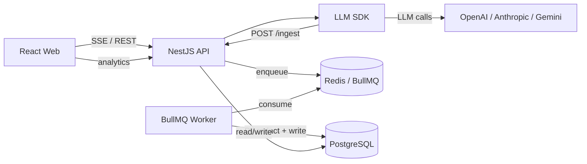

# LLM Observe

LLM inference logging and ingestion system built as a Turborepo monorepo with React, NestJS (Fastify), BullMQ, PostgreSQL, and Redis.

## Prerequisites

- Docker + Docker Compose
- Node.js 20+
- pnpm 9+

## Quick Start (Docker)

```bash
cp .env.example .env
# Fill in OPENAI_API_KEY, ANTHROPIC_API_KEY, and/or GEMINI_API_KEY

docker compose up --build
```

Services:

| Service  | URL                          |
| -------- | ---------------------------- |
| Web UI   | http://localhost:5173        |
| API      | http://localhost:3001/api    |
| Bull Board | http://localhost:3001/admin/queues |

## Local Development

Start Postgres and Redis (via Docker or locally), then:

```bash
cp .env.example .env
pnpm install
pnpm db:generate
pnpm db:push

# Run all apps in parallel
pnpm dev
```

Individual apps:

```bash
pnpm --filter @llm-observe/api dev
pnpm --filter @llm-observe/worker dev
pnpm --filter @llm-observe/web dev
```

## Architecture



### Data Flow

1. User sends a chat message via the web UI (SSE streaming).
2. API uses the SDK to call the LLM provider.
3. SDK emits inference metadata to `POST /api/ingest` (fire-and-forget).
4. API validates with Zod and enqueues to BullMQ.
5. Worker applies PII redaction and persists to `inference_logs`.
6. Dashboard reads aggregated metrics from PostgreSQL.

## Schema Design

- **Conversations** are top-level entities; messages belong to a conversation.
- **inference_logs** is append-only — one row per LLM call.
- **input_preview / output_preview** store truncated, PII-redacted text (max 500 chars).
- **metadata** JSON column holds provider-specific extras.
- Indexes on `(created_at, provider, status)` support dashboard queries.

## Tradeoffs

| Decision | Rationale |
| -------- | --------- |
| Postgres over ClickHouse | Simpler ops for assignment scope; sufficient for moderate log volume |
| EventEmitter2 over Kafka | Internal decoupling without distributed messaging overhead |
| SSE over WebSockets | Unidirectional streaming fits LLM token delivery |
| BullMQ over sync writes | Ingestion never blocks chat responses |

## Future Improvements

- KEDA for queue-depth-based worker autoscaling
- ClickHouse for long-retention metrics at scale
- OpenTelemetry end-to-end tracing
- Vault / AWS Secrets Manager for production secrets

## Kubernetes

Apply manifests:

```bash
kubectl apply -f k8s/namespace.yaml
kubectl apply -f k8s/configmap.yaml
kubectl apply -f k8s/secret.yaml
kubectl apply -f k8s/statefulsets/
kubectl apply -f k8s/deployments/
kubectl apply -f k8s/services/
kubectl apply -f k8s/ingress.yaml
kubectl apply -f k8s/hpa/
```

## Project Structure

```
llm-observe/
├── apps/
│   ├── web/       # React + Vite frontend
│   ├── api/       # NestJS API server
│   └── worker/    # BullMQ log consumer
├── packages/
│   ├── sdk/       # LLM wrapper / interceptor
│   ├── db/        # Prisma schema + client
│   ├── pii/       # PII redaction
│   └── types/     # Shared types & Zod schemas
├── k8s/           # Kubernetes manifests
└── docker-compose.yml
```
